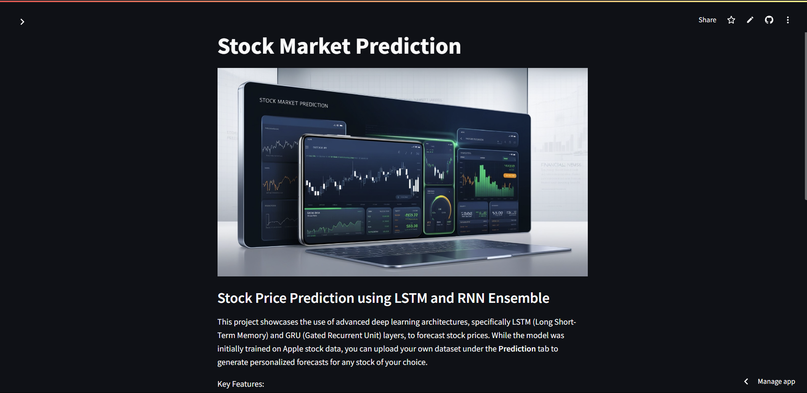

# Apple Stock Price Prediction  
## LSTM and RNN Ensemble for Time Series Forecasting

This project demonstrates the use of advanced deep learning architectures, specifically LSTM (Long Short-Term Memory) and GRU (Gated Recurrent Unit) layers, to forecast Apple stock prices. While primarily focused on Apple stock, the model is flexible enough to handle datasets with similar fields (like open, close, high, low prices).

### Key Features
- **Data Preparation and Preprocessing**  
  - Data is scaled using `MinMaxScaler` for optimal performance. A sliding window approach is used to capture temporal dependencies effectively by creating input sequences.

- **Flexible Model Architecture with `EnhancedModel`**  
  - The `EnhancedModel` class supports multiple RNN architectures like LSTM, GRU, and Bidirectional LSTM. It allows custom configurations such as units, dropout rates, and layer types.

- **Hyperparameter Tuning with KerasTuner**  
  - KerasTuner’s `RandomSearch` finds the best hyperparameter configuration based on validation loss, optimizing parameters like LSTM/GRU units, dropout rates, learning rates, and RNN type.

- **Ensemble Learning Approach**  
  - Multiple models are averaged to improve prediction accuracy, leveraging the strengths of each architecture to reduce variance and yield stable predictions.

- **Comprehensive Performance Evaluation**  
  - Model performance is evaluated with RMSE, MAE, and R² metrics. Comparative results between individual models and the ensemble show improved prediction accuracy for stock forecasting.

- **Visualizations**  
  - Actual vs. predicted stock prices are visualized to demonstrate model performance. Additional visualizations, like residual and error distribution plots, highlight accuracy and model improvements.

### Performance Metrics
- **Ensemble Model RMSE**: 0.0123
- **Ensemble Model MAE**: 0.0101
- **Ensemble Model R²**: 0.972

These metrics demonstrate the ensemble model's effectiveness in achieving high prediction accuracy for stock forecasting.

### Usage Instructions
1. **Data Preparation**: Ensure columns match the format used for training (like Apple's historical data).
2. **Model Configuration and Training**  
   - Use the `EnhancedModel` class to experiment with architectures and run KerasTuner to find optimal hyperparameters.
3. **Evaluation and Visualization**  
   - Evaluate the model using RMSE, MAE, and R² metrics, and plot actual vs. predicted values for validation.

### Dependencies
- `tensorflow`
- `keras-tuner`
- `scikit-learn`
- `matplotlib`
- `streamlit`

### License
This project is licensed under the MIT License. See the [LICENSE](LICENSE) file for more details.

---

This project is a robust foundation for time series forecasting with deep learning, especially useful for those exploring ensemble methods in predictive modeling.

